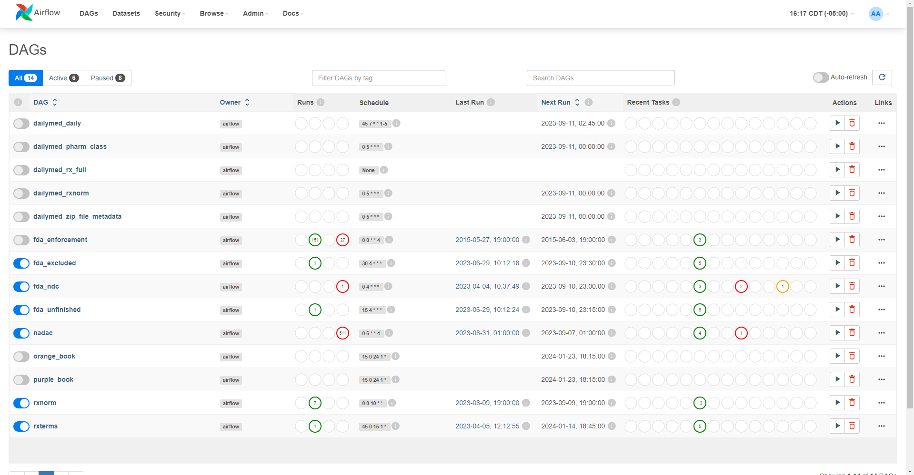
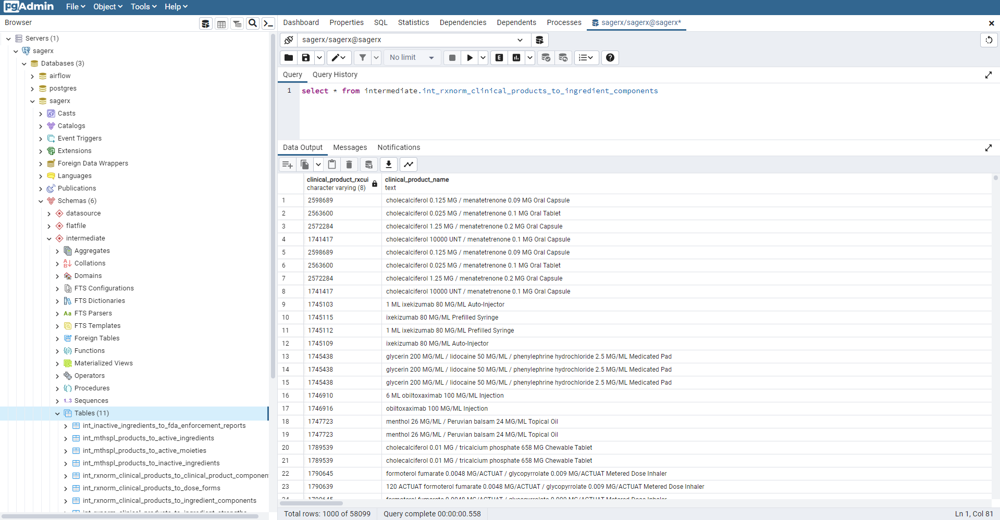

# 🌿 SageRx

SageRx is a medication ontology and medication-related data aggregator created from many different public sources of data.

Including data from DailyMed, FDA, RxNorm, Orange Book, and more!

SageRx uses Airflow to schedule jobs to extract, load, and transform (using dbt) open drug data.

Data ends up in a PostgreSQL database and can be queried using pgAdmin (included with SageRx) or via any SQL editor of your choice.

## Additional Documentation

We will be moving documentation over to Github, but additional documentation exists on the [SageRx Website](https://coderx.io/sagerx).

Subscribe to our [newsletter](https://coderxio.substack.com/) to keep ontop of updates.

## License

## Contributing

We would love to see you contribute to SageRx. Join our [Slack](https://join.slack.com/t/coderx/shared_invite/zt-5b8e9kr4-PsKAVe4crGmECQyyxDIJgQ) channel to get involved.

## Development Quickstart

### Prerequisites

- Install [Docker](https://docs.docker.com/desktop/).
  - Windows users will also install WSL 2 (a Linux subsystem that runs on Windows) as part of this process.

### Installation

1. Clone the repo.
2. Add a `.env` file at the root of the repo.
3. Add ENV vars to the `.env` file.
   - `AIRFLOW_UID=<uid>` - UID can be found by running `id -u` on linux systems, typically the first user on the system is `1000` or `1001`.
     - Windows users following the Docker Desktop install guide should have WSL 2 installed. You can open up command line, type `wsl` and then within WSL 2, you can enter `id -u` to see your UID.
   - `UMLS_API=<umls_api_key>` - if you want to use RxNorm, you need an API key from [UMLS](https://uts.nlm.nih.gov/uts/signup-login).
4. Make sure Docker is installed
5. Run `docker-compose up airflow-init`.
6. Run `docker-compose up`.

> NOTE: if you have an [M1 Mac](https://stackoverflow.com/questions/62807717/how-can-i-solve-postgresql-scram-authentication-problem) `export DOCKER_DEFAULT_PLATFORM=linux/amd64`, and re-build your images

### Server URLs

- Airflow UI is hosted on `localhost:8001` or `0.0.0.0:8001`
  - Username/password = `airflow` / `airflow`
- PgAdmin is hosted on `localhost:8002` or `0.0.0.0:8002`
  - Username/password = `sagerx` / `sagerx`

### Using dbt

On `docker-compose up` a dbt container will be created to be used for cli commands. To enter commands run `docker exec -it dbt /bin/bash`. This will place you into a bash session in the dbt container. Then you can run dbt commands as you normally would.

### Troubleshooting

If you get issues on folder permissions:

`sudo chmod -R 777 postgres,data,extracts,logs,plugins`
